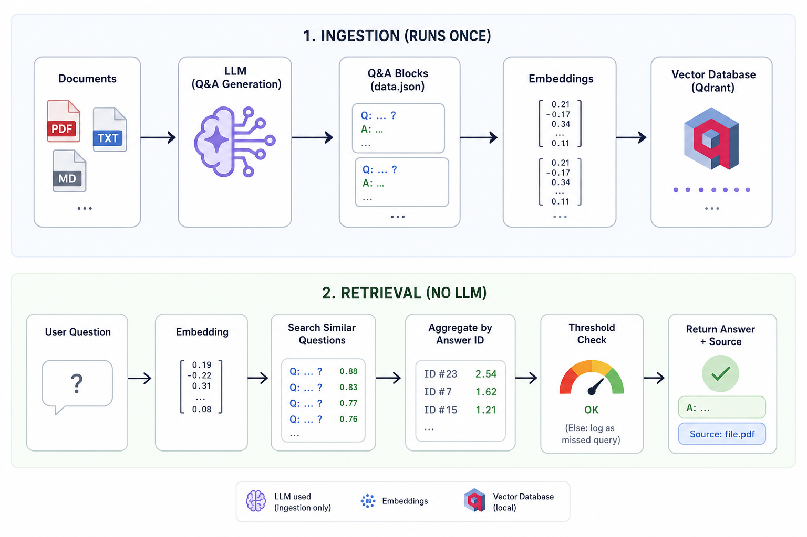

# RAGless

RAGless is a semantic retrieval system that answers questions about your documentation, **without using an LLM at runtime**.

Most Q&A systems today are built on RAG: retrieve some context, send it to a language model, generate an answer. RAGless takes a different approach. During ingestion, an LLM converts your documents into a comprehensive set of Question & Answer pairs — automatically covering the full breadth of the source material. At query time, the user's question is matched semantically against those pre-generated questions — and the corresponding answer is returned directly, with no generation step.

The result is a system that is fast, deterministic, and hallucination-free by design.

[See it in action](https://youtu.be/AQnVMuAVPBA)

---

## RAGless vs RAG

| | RAG | RAGless |
|---|---|---|
| LLM at query time | ✅ Yes | ❌ No |
| Hallucination risk at query time | Present | None |
| Runtime cost | Per query | Zero |
| Latency | Higher | Very low |
| Answer predictability | Variable | Deterministic |
| Best for | Open-ended Q&A | Closed knowledge bases |

RAGless is not a replacement for RAG in general. It is a better fit when your answers are known in advance and consistency matters more than flexibility — internal documentation, product manuals, customer support, policy documents.

A single document can generate hundreds of Q&A pairs automatically, covering the full breadth of the source material. This is not about listing a handful of frequent questions — it is about making every piece of information in your documentation queryable.

---

## Features

- Semantic retrieval using embeddings
- No LLM required during user queries
- Automatic Q&A generation from PDF, TXT and Markdown documents — full coverage of the source material
- Multiple semantic question variants per answer (Q-Q matching)
- Score aggregation by answer ID for more robust retrieval
- Local Qdrant vector database (no server, no Docker)
- Configurable similarity threshold with OOD detection
- Optional LLM-as-a-Judge validation during ingestion
- Automatic logging of unanswered queries for continuous improvement

---

## Architecture

```
Raw Documents
      │
      ▼
prepare_data.py          ← LLM used here (ingestion only)
      │
      ▼
Generated Q&A Blocks (data.json)
      │
      ▼
ingest_to_qdrant.py      ← Embeddings generated here
      │
      ▼
Qdrant Vector Database
      │
      ▼
chatbot.py               ← No LLM, pure retrieval
      │
      ▼
Semantic Retrieval
```

---

## Project Structure

```
RAGless/
│
├── source/              ← Your documents go here
│   ├── manual.pdf
│   ├── faq.txt
│   └── notes.md
│
├── failed_chunks/       ← Chunks that couldn't be parsed (auto-saved)
│
├── config.py
├── prepare_data.py
├── ingest_to_qdrant.py
├── chatbot.py
├── data.json
├── missed_queries.log
├── requirements.txt
└── .env
```

---

## How It Works

RAGless consists of two completely separate phases.

### Ingestion (runs once)

```
Documents (PDF / TXT / MD)
        │
        ▼
Extract Text
        │
        ▼
Token Counting
        │
        ▼
Chunking (if necessary)
        │
        ▼
Gemini Q&A Generation
        │
        ▼
Generate Question Variants
        │
        ▼
(Optional) LLM-as-a-Judge
        │
        ▼
Save Q&A Blocks (data.json)
        │
        ▼
Generate Embeddings
        │
        ▼
Store in Qdrant
```

Each Q&A block contains: a unique ID, an answer, multiple semantic question variants, a category, the source file, and the source quote.

Every question variant gets its own embedding. This is the key to Q-Q matching.

### Retrieval (no LLM involved)

```
User Question
      │
      ▼
Generate Embedding
      │
      ▼
Search Top-K Similar Questions
      │
      ▼
Aggregate Scores by Answer ID
      │
      ▼
Threshold Check
      │
      ├──── Below threshold → log missed query
      │
      ▼
Return Answer + Source File
```

Instead of picking the single nearest question, RAGless aggregates similarity scores across all question variants that belong to the same answer. This makes retrieval significantly more robust when multiple phrasings of the same question exist in the knowledge base.

---

## Installation

Clone the repository.

```bash
git clone https://github.com/EmilResearch/RAGless.git
cd RAGless
```

Create and activate a virtual environment.

```bash
python -m venv .venv

# macOS / Linux
source .venv/bin/activate

# Windows
.venv\Scripts\activate
```

Install dependencies.

```bash
pip install -r requirements.txt
```

Create a `.env` file.

```env
GEMINI_API_KEY=YOUR_API_KEY
```

---

## Usage

### Prepare your documents

Copy your documents into the `source/` directory. Supported formats: PDF, TXT, Markdown.

### Step 1 — Generate the knowledge base

```bash
python prepare_data.py
```

With optional AI validation:

```bash
python prepare_data.py --judge
```

This reads every document, splits large files into chunks, generates Q&A blocks using Gemini, and saves everything to `data.json`.

### Step 2 — Build the vector database

```bash
python ingest_to_qdrant.py
```

This reads `data.json`, generates embeddings, and stores them in a local Qdrant collection.

### Step 3 — Start the chatbot

```bash
python chatbot.py
```

Example:

```
You> How do I connect to the hotel Wi-Fi?

──────────────────────────────────────────────────────────────────────
The Wi-Fi network is "HotelGuest". The password is available at the reception desk or on the welcome card in your room.
──────────────────────────────────────────────────────────────────────
Source: hotel_manual.pdf
```

### Custom threshold

```bash
python chatbot.py --threshold 0.75
```

Higher threshold → fewer false positives, more unanswered questions.
Lower threshold → higher recall, increased risk of incorrect matches.

---

## Configuration

All parameters are centralized in `config.py`. No magic numbers are scattered across the codebase.

Key settings:

- `EMBEDDING_MODEL` — embedding model (default: `gemini/gemini-embedding-001`)
- `VECTOR_SIZE` — output dimensionality (default: 3072)
- `TOP_K_RETRIEVAL` — candidates pulled from Qdrant before aggregation (default: 10)
- `DEFAULT_THRESHOLD` — minimum aggregated score to return an answer (default: 0.70)
- `SINGLE_HIT_THRESHOLD` — fallback threshold on the best single hit (default: 0.82)
- `CHUNK_SIZE` / `OVERLAP` — chunking parameters for large documents

---

## Local Embeddings (offline mode)

RAGless uses LiteLLM for embeddings, which supports local providers out of the box. If you want to run fully offline, you can replace Gemini with a local model — no code changes required.

**Example with Ollama:**

1. Install [Ollama](https://ollama.com) and pull an embedding model:

```bash
ollama pull nomic-embed-text
```

2. Update `config.py`:

```python
EMBEDDING_MODEL = "ollama/nomic-embed-text"
VECTOR_SIZE = 768  # match the model's output dimension
```

3. Re-run ingestion:

```bash
python ingest_to_qdrant.py
```

Any embedding model exposed via Ollama or LM Studio works the same way. Just make sure `VECTOR_SIZE` matches the model's actual output dimension, and re-run ingestion whenever you switch models.

---

## Output Files

**`data.json`** — the generated knowledge base: Q&A blocks covering the full source documentation.

```json
{
    "id": "...",
    "answer": "...",
    "questions": ["...", "...", "..."],
    "category": "...",
    "source_file": "...",
    "source_quote": "..."
}
```

**`failed_chunks/`** — if Gemini returns malformed JSON, the original chunk is saved here for manual inspection.

**`missed_queries.log`** — every query that fell below the similarity threshold is logged with a timestamp and score. Use this to identify gaps in your knowledge base.

---

## Known Limitations

**Gemini lock-in.** Both the LLM (for ingestion) and the embedding model are Gemini-based. Switching provider requires updating `config.py` and re-running the full ingestion pipeline. There is no provider abstraction layer.

**Quality depends on ingestion.** The retrieval is only as good as the Q&A blocks generated in Step 1. There is no built-in evaluation tool to measure how well the generated questions cover the source documents. If you want to validate quality, sample `data.json` manually after ingestion.

**Local Qdrant limitations.** RAGless uses Qdrant in embedded mode (no server required). This works well for single-process use cases up to tens of thousands of FAQ entries. For concurrent access or larger collections, migrate to a Qdrant server instance and update `QDRANT_PATH` in `config.py` to a URL.

---

## Future Improvements

- Cross-encoder reranking
- Automatic evaluation dataset
- Incremental ingestion (avoid full re-ingestion on document updates)
- Metadata filtering by category
- REST API
- Web interface
- Multi-language support
- Docker deployment

---

## License

Apache 2.0 License.
